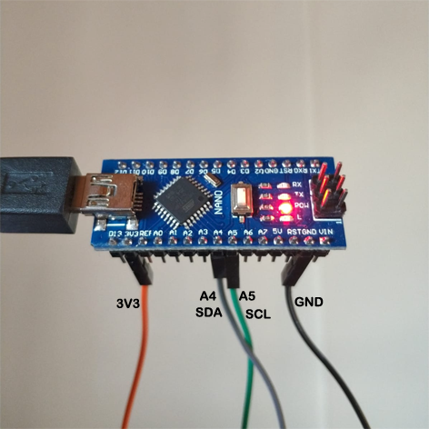
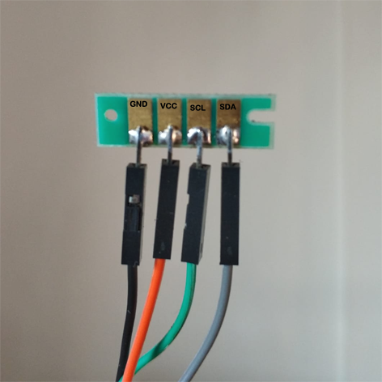

+++
date = '2026-05-30T01:19:43+03:00'
draft = false
title = 'Ricoh SP150 Hack'
+++

Many printers estimate the remaining ink using a counter stored on a chip 
rather than measuring the actual amount of material remaining. Once the 
counter reaches zero, the printer may reject the cartridge even if it still 
contains ink. As a result, refilling the cartridge alone may not restore it.

[This article](http://www.yuempek.com/blog/ricoh-sp150-chip-resetleme/) 
explains how to reset the cartridge chip for a Ricoh SP150 printer.
This page is for preserving a summary and the Arduino code for future reference.

## Summary

The cartridge chip communicates with the printer using the I2C protocol. Its 
stored data can be read and rewritten through the same interface. Connect the 
Arduino to the chip as shown in the image, then run the code below. The I2C 
address and Arduino pins may need to be adjusted for the specific chip and hardware.




```c
// Update EEPROM_I2C_ADDRESS define value with the chip you want to reprogram
// 83 is Chip K - black
#define EEPROM_I2C_ADDRESS 83
#include <Wire.h>

byte KChipData[]={ 50,0,1,3,18,1,1,255,100,0,52,48,55,53,52,51,20,9,65,66,22,0,22,38,255,255,255,255,255,255,255,255,255,255,255,255,255,255,255,255,255,255,255,255,100,0,0,0,255,255,255,255,255,255,255,255,255,255,255,255,255,255,255,255,255,255,255,255,255,255,255,255,255,255,255,255,255,255,255,255,255,255,255,255,255,255,255,255,255,255,255,255,255,255,255,255,255,255,255,255,255,255,255,255,255,255,255,255,255,255,255,255,255,255,255,255,255,255,255,255,0,0,0,0,0,0,0,0};
void setup() {

// find EEPROM_I2C_ADDRESS 
// WhatI2CAddress();
// return;

 byte WriteData[128];
 memcpy(WriteData,KChipData,128*sizeof(byte));

 // Start Wire and Serial bus
 Wire.begin();
 Serial.begin(9600);
 delay(1000);

Serial.println("Start");
Serial.println(" ");
delay(3000);
Serial.println("go");

if (0){ // set to 1 to write to chip
 Serial.println("Write 128 bytes:");
 byte wordaddress;

 for(byte i=0;i<128;i++){
   wordaddress = i;
   i2cwrite((byte)wordaddress,(byte)WriteData[i]);
   //Serial.print(wordaddress);
   //Serial.print(":");
   Serial.print(WriteData[i]);
   Serial.print(",");
 }
}

// Start Read chip
 Serial.println(" ");
 Serial.println("Read 128 bytes:");
 for(byte i=0;i<128;i++){
   byte readVale = i2cread(i);
   //Serial.print(i);
   //Serial.print(":");
   Serial.print(readVale);
   Serial.print(",");
 } 
 Serial.println(" "); 
 Serial.println("End");

}

void loop() {

}

void i2cwrite(byte address, byte data) {
 Wire.beginTransmission(EEPROM_I2C_ADDRESS);
 Wire.write((byte)address);
 Wire.write((byte)data);
 Wire.endTransmission();
 delay(20);
}

byte i2cread(byte address) {
  byte rData = 0;
  Wire.beginTransmission(EEPROM_I2C_ADDRESS);
  Wire.write((byte)address);
  Wire.endTransmission();

  Wire.requestFrom(EEPROM_I2C_ADDRESS,1);
  while (Wire.available()){
    rData = Wire.read();
    return rData;
  }
}

void WhatI2CAddress() {
  Serial.println("started");
  for(int i=0;i<128;i++){
    Wire.requestFrom(i,1); //request first data byte
    Serial.print(i);
    Serial.print(":");
    while(Wire.available()){
      byte c = Wire.read();
      Serial.print(c); //if data exist, print it out. That way you can identify which address.
    }
    Serial.println(" ");
    delay(5);
  }
}
```
