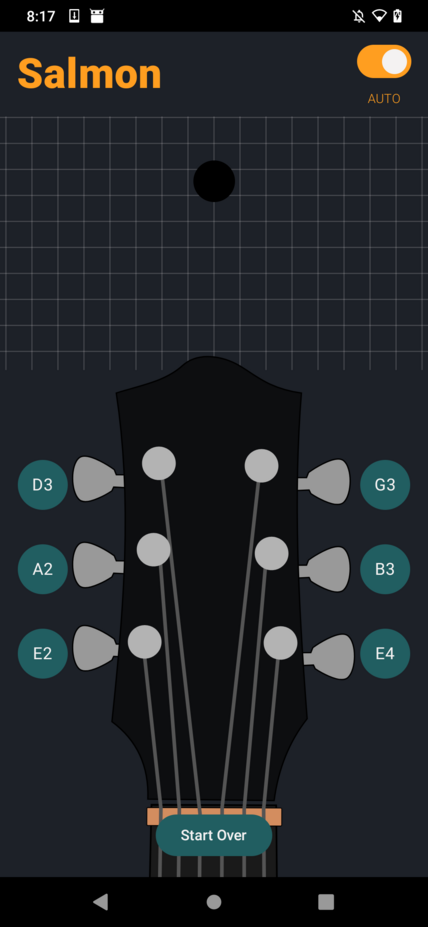
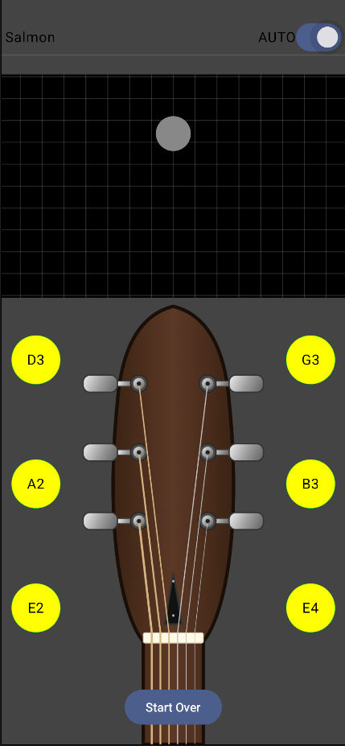

The motivation for this project stems from the lack of polished open source tuner apps. 
Existing open source tools lack the polished interface and intuitive interaction design 
found in premium, closed source apps like [GuitarTuna](https://guitartuna.com/). The 
objective of this project was to replicate a premium UI/UX while providing a transparent, 
open source implementation using modern Android development practices. You can 
[check the app source](https://github.com/degD/salmon). It is 
[available on F-Droid](https://f-droid.org/packages/net.dege.salmon/) as well.

## Development Roadmap

1. **UI/UX Architecture Design**: Implementing an interface using Jetpack Compose.
2. **Audio Signal Processing**: Integrating real-time pitch detection.
3. **Refinement and Optimization**: Polishing the interface and tuning frequency detection.

## Phase 1: UI/UX Architecture



The interface was developed using **Jetpack Compose**, focusing on a state-driven 
architecture to ensure the UI remains synchronized with the audio input. The 
application architecture is divided into three distinct layers:

*   **TunerState.kt**: Manages the reactive state of the application.
*   **TunerViewModel.kt**: Acts as the intermediary, processing pitch data and updating the state.
*   **TunerScreen.kt**: The declarative UI layer composed of specialized components.

To ensure an intuitive tuning experience, a _slider_ calculates pitch deviation in 
[cents](https://en.wikipedia.org/wiki/Cent_(music)). Given that the interval between two 
semitones is exactly 100 cents, this mathematical approach ensures that pitch deviation 
is represented symmetrically on both sides of the target note, providing the user with 
a sense of direction.

## Phase 2: Real-Time Pitch Detection

For the audio processing engine, I integrated [TarsosDSP](https://github.com/JorenSix/TarsosDSP) 
via a custom Kotlin implementation. The core logic utilizes the `FFT_YIN` algorithm for frequency 
estimation, providing a balance between computational efficiency and accuracy. You can see the
ported example pitch detection below.

```kotlin
package net.dege.salmon

import be.tarsos.dsp.io.android.AudioDispatcherFactory
import be.tarsos.dsp.pitch.PitchDetectionHandler
import be.tarsos.dsp.pitch.PitchProcessor
import be.tarsos.dsp.pitch.PitchProcessor.PitchEstimationAlgorithm
import kotlin.concurrent.fixedRateTimer
import kotlin.concurrent.thread

class TunerFunctionality {
    private val _sampleRate = TunerConfig.SAMPLE_RATE
    private val _audioBufferSize = TunerConfig.AUDIO_BUFFER_SIZE
    private val _bufferOverlap = TunerConfig.BUFFER_OVERLAP

    /**
     * Initializes and starts the audio dispatcher 
     * for real-time pitch detection.
     */
    fun startTuner(callback: (pitch: Float, probability: Float) -> Unit) {
        val audioDispatcher = AudioDispatcherFactory.fromDefaultMicrophone(
            _sampleRate, _audioBufferSize, _bufferOverlap
        )
        val pdh = PitchDetectionHandler { result, _ -> 
            callback(result.pitch, result.probability) 
        }
        val audioProcessor = PitchProcessor(
            PitchEstimationAlgorithm.FFT_YIN,
            _sampleRate.toFloat(), _audioBufferSize, pdh
        )

        audioDispatcher.addAudioProcessor(audioProcessor)
        thread(name = "tuning-thread") {
            audioDispatcher.run()
        }
    }

    /**
     * Manages session inactivity by triggering a callback 
     * when no audio input is detected.
     */
    fun startTunerInactivityLimit(callback: () -> Unit) {
        fixedRateTimer(
            name = "inactivity-timer",
            initialDelay = 0.toLong(),
            period = 10
        ) {
            callback()
        }
    }
}
```

- **sampleRate**: The number of audio samples captured per second (e.g., 44,100 Hz). 
This defines the frequency range the app can accurately detect.
- **audioBufferSize**: The number of audio samples processed in a single processing 
block. Smaller buffers reduce latency but increase CPU load; larger buffers 
are more stable but introduce a delay.
- **bufferOverlap**: The number of samples shared between consecutive buffers. 
Overlapping ensures that signal transitions aren't lost at the edges of a buffer, 
resulting in smoother detection.

## Phase 3: Refinement and Optimization

This stage of development focused on stabilizing the user experience. The perceived latency 
between the plucking of the string and the feedback on the screen is minimized by tuning the 
SAMPLE_RATE and AUDIO_BUFFER_SIZE. Configuration of the buffer overlap helped the FFT_YIN 
algorithm to provide a continuous, rather than jittery, stream of frequency data.

An inactivity monitoring system is implemented to prevent the UI from displaying "frozen" 
pitch values when the instrument is not being played, which ensures a clean interface.
