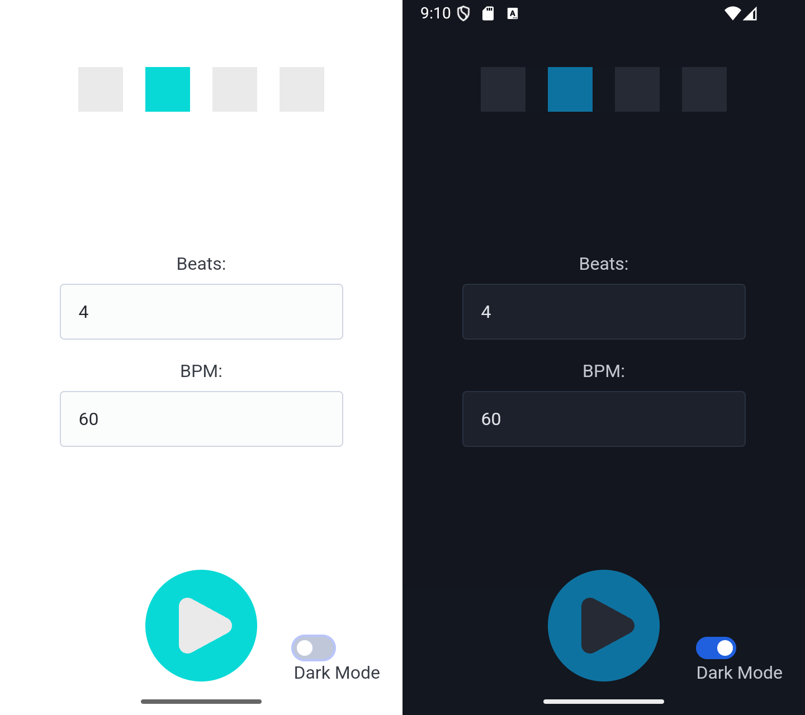

+++
date = '2026-05-30T01:04:15+03:00'
draft = false
title = 'YAM (Yet Another Metronome)'
+++

[Yet Another Metronome (YAM)]((https://github.com/degD/yet_another_metronome)) is a free, 
ad-free, open-source metronome app built for musicians who need a wider BPM range than many 
existing apps provide. Most metronome limit the tempo to around 200 BPM. YAM supports tempos 
of up to 600 BPM, along with up to 20 beats per measure. YAM is also 
[available on F-Droid](https://f-droid.org/packages/com.degeder.yam/).

The app was built with [Capacitor.js](https://capacitorjs.com/), which made it possible to 
create a cross-platform mobile app. The app icon and splash screen are based on 
[this metronome icon](https://www.svgrepo.com/svg/517774/metronome). The sound effects were 
sourced from [this recording](https://freesound.org/people/gherat/sounds/139653) and 
[this recording](https://freesound.org/people/Entershift/sounds/704134/).

## Features

- Simple interface
- Light and dark themes with a quick toggle
- BPM range of up to 600
- Up to 20 beats per measure
- Free and open-source under the GPLv3 license
- No advertisements

## App Images

